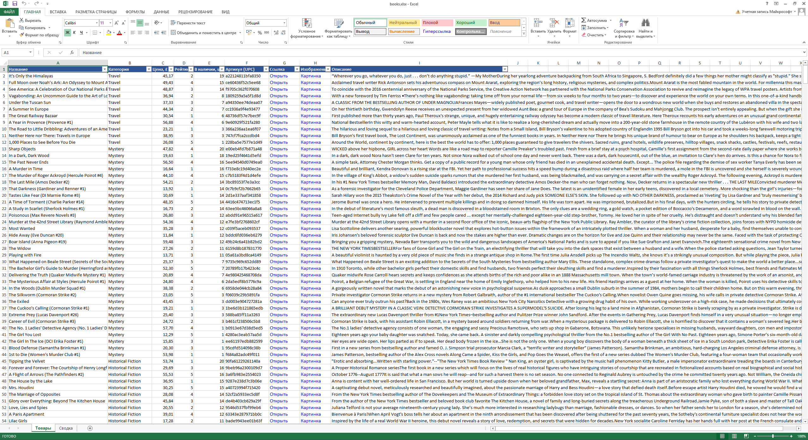

# Парсер каталога интернет-магазина → Excel / CSV

Собирает все товары каталога — с обходом категорий и страниц, загрузкой карточек и выгрузкой в аккуратную Excel-таблицу со сводкой.

Демо работает на [books.toscrape.com](https://books.toscrape.com/) — сайте, созданном специально для практики парсинга (1000 товаров, 50 категорий). Тот же подход применяется к любому каталогу: магазину, доске объявлений, справочнику компаний, сайту поставщика.

<!-- Сюда добавить демо: docs/demo.gif и скриншот таблицы docs/excel.png -->




## Что собирается

| Поле | Пример |
|---|---|
| Название | A Light in the Attic |
| Категория | Poetry |
| Цена | 51.77 |
| Рейтинг (1–5) | 3 |
| В наличии, шт. | 22 |
| Артикул (UPC) | a897fe39b1053632 |
| Ссылка на товар | кликабельная |
| Ссылка на изображение | кликабельная |
| Описание | полный текст из карточки |

## Возможности

- **Весь каталог или выборочно**: по всем категориям или только по нужным
- **Постраничный обход**: проходит все страницы категории до последней
- **Карточки товаров**: заходит в каждую карточку за подробными данными
- **Многопоточность**: несколько карточек загружаются параллельно — 1000 товаров за несколько минут
- **Бережно к сайту**: случайные паузы между запросами, повторы при сбоях сети и ответах 429/5xx
- **Устойчивость**: одна битая карточка не останавливает сбор, ошибки выводятся в конце
- **Excel «под ключ»**: оформленная шапка, фильтры, закреплённая строка, кликабельные ссылки, числовые форматы
- **Лист «Сводка»**: количество товаров, средняя/мин/макс цена, рейтинг и остатки по каждой категории + итог
- **CSV для любых систем**: разделитель `;` и кодировка, которую русский Excel открывает без кракозябр

## Запуск

Нужен Python 3.10 или новее.

```bash
pip install -r requirements.txt
```

```bash
python parser.py                                  # весь каталог → books.xlsx
python parser.py --limit 50                       # первые 50 товаров, для быстрой проверки
python parser.py --categories "Travel, Mystery"   # только выбранные категории
python parser.py --output books.csv               # выгрузка в CSV
python parser.py --workers 8 --delay 0.1          # быстрее (осторожно с чужими сайтами)
```

Все параметры: `python parser.py --help`.

## Программа без Python

Для заказчика парсер можно собрать в один `.exe`, который запускается двойным кликом:

```bash
pip install pyinstaller
pyinstaller --onefile --name catalog-parser parser.py
```

Готовый файл появится в папке `dist`.

## Стек

Python · requests · BeautifulSoup · openpyxl

---

Нужен парсер под ваш сайт — с выгрузкой в Excel, Google Таблицы или базу данных, по расписанию, с уведомлениями в Telegram? Пишите.
